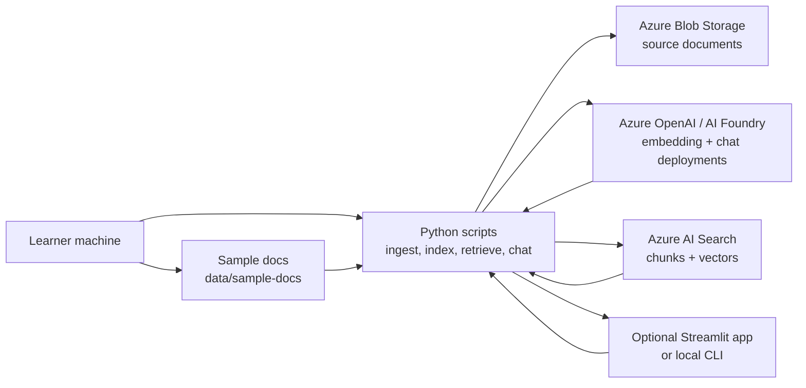

# Part 1 Architecture

This repo builds the smallest useful Azure RAG companion app for teaching. It is meant to show the moving parts clearly, not to serve as an enterprise reference architecture.

Part 1 creates and explains the Azure foundation. Later parts add document ingestion, indexing, retrieval, chat, and an optional Streamlit interface.

The Part 1 checkpoint contains only the architecture, setup instructions, repo
scaffold, and Terraform needed to create and destroy the Azure foundation.
Part 2 adds source documents and indexing scripts. Part 3 adds retrieval while
keeping chat calls and UI code deferred until their own steps.

## What The Final App Builds

By the end of the series, the repo will contain:

- Terraform-managed Azure resources for a small RAG environment.
- A tiny sample document set under `data/sample-docs/`.
- Python scripts for loading documents, chunking text, creating embeddings, writing an Azure AI Search index, and asking questions over retrieved context.
- A local app entry point in `app/`, with an optional Streamlit UI if the lesson needs a browser-based chat surface.
- Beginner-focused setup, troubleshooting, and teardown docs.

The final app answers questions over a small document collection. It is not a production chatbot, document management system, compliance archive, private networking blueprint, or enterprise RAG platform.

## Azure Resources

The intended Azure architecture uses these services:

- **Azure Blob Storage** stores source documents for the lesson. Early parts may also read local files from `data/sample-docs/`, but Blob Storage is the durable Azure landing place in the final architecture.
- **Azure AI Search** stores searchable chunks and vector fields so the app can retrieve relevant passages.
- **Azure OpenAI or Azure AI Foundry-compatible Azure OpenAI deployments** provide:
  - one embedding deployment for indexing and query vectors;
  - one chat deployment for final answers.
- **Python scripts** connect the pieces: upload or read files, chunk text, call the embedding deployment, populate the search index, retrieve matches, and call the chat deployment.
- **Optional Streamlit app** gives learners a simple browser UI after the backend flow is working.

Use one dedicated Azure resource group for the project so cost review and teardown stay simple.

## Diagram

## Runtime Flow

The final app flow is intentionally direct:

1. Put a few sample files in `data/sample-docs/` or in the Blob Storage container.
2. Run a Python ingestion script.
3. The script chunks each document.
4. The script calls the embedding deployment.
5. The script writes chunk text, metadata, and vectors to Azure AI Search.
6. Ask a question through the local app or optional Streamlit UI.
7. The app embeds the question, retrieves matching chunks from Azure AI Search, and sends the question plus retrieved context to the chat deployment.

Part 1 stops at the architecture and infrastructure foundation. It should leave learners with a clear resource group, clear configuration names, and a teardown path before any RAG logic is added.

## Configuration Contract

The app and scripts read local configuration from `.env`, copied from `.env.example`.

Important settings include:

- `AZURE_SUBSCRIPTION_ID` and `AZURE_TENANT_ID` as reference values for the active Azure account context;
- `AZURE_RESOURCE_GROUP`
- `AZURE_LOCATION`
- `AZURE_OPENAI_ENDPOINT`
- `AZURE_OPENAI_CHAT_DEPLOYMENT`
- `AZURE_OPENAI_EMBEDDING_DEPLOYMENT`
- `AZURE_OPENAI_API_KEY`
- `AZURE_SEARCH_ENDPOINT`
- `AZURE_SEARCH_INDEX_NAME`
- `AZURE_SEARCH_API_KEY`
- `AZURE_STORAGE_ACCOUNT_NAME`
- `AZURE_STORAGE_ACCOUNT_URL`
- `AZURE_STORAGE_ACCOUNT_KEY`
- `AZURE_STORAGE_CONTAINER_NAME`

This teaching repo uses key-based local authentication because it is easier to explain on video. Managed identity, private endpoints, network isolation, RBAC-only data access, CI/CD secrets, monitoring, and production governance are outside this smallest-useful version.

## Cost Boundaries

The billable resources are the main reason Part 1 includes teardown from the beginning.

Watch especially for:

- Azure AI Search services that continue billing while idle.
- Azure OpenAI token usage and regional quota limits.
- Storage accounts, transaction costs, and retained blobs.
- Logging, diagnostics, or extra services added while experimenting.

Use the smallest SKUs that support the lesson, set a budget or spending alert, inspect every Terraform plan, and destroy the resource group when you are done practicing.

## What Later Parts Add

Part 2 adds the first sample documents, Blob upload flow, and Search indexing.
Part 3 adds retrieval inspection. Part 4 adds chat, then tightens validation,
troubleshooting, and deployment notes.

Those later parts should build on this architecture without changing the teaching goal: keep the app small enough that a learner can understand every moving piece.
